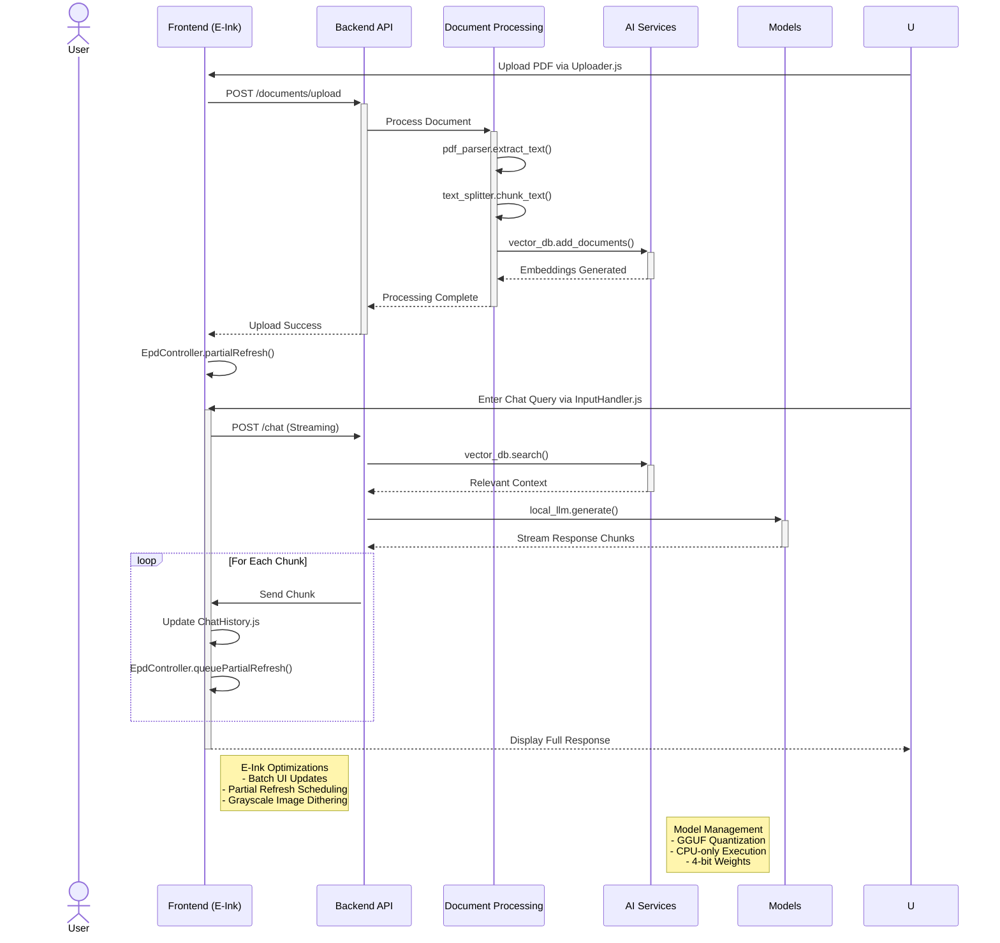
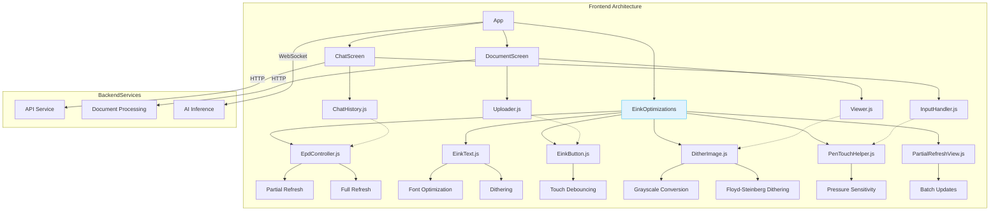
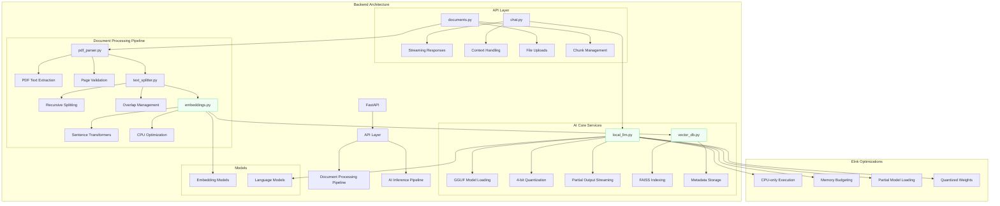
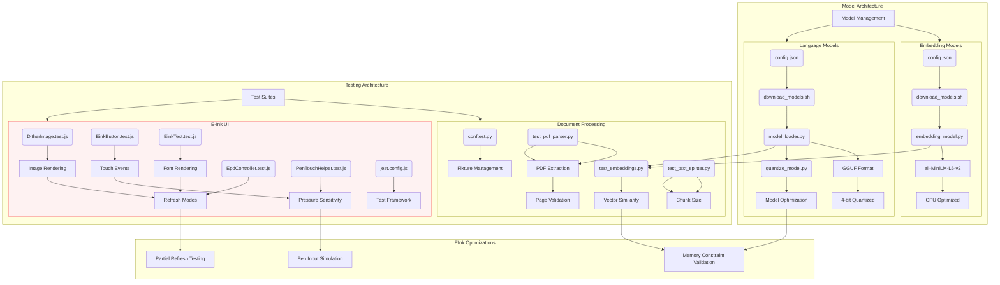

[](https://github.com/gongahkia/faraday/releases/tag/1.0.0) 

# `Faraday` ⚡️

Full Stack AI Chat solution for your [Onyx Boox](https://www.boox.com/) devices.

`Faraday` provides both a Frontend on your [Onyx E-Ink Device](#frontend) and a [Local AI](#model) [Backend](#backend), optimized for [battery life and document processing](#other-notes).

## Stack

* *Frontend*: [React Native](https://reactnative.dev/), [Generic Onyx Boox SDK](https://github.com/stevezuo/booxsdk)
* *Backend*: [FastAPI](https://fastapi.tiangolo.com/), [Uvicorn](https://www.uvicorn.org/), [Python](www.python.org)
* *Package*: [Docker](https://www.docker.com/)
* *SDK*: [Onyx Boox Android SDK](https://github.com/onyx-intl/OnyxAndroidDemo)
* *Auth*: [JWT](https://jwt.io/introduction)
* *Protocol*: [HTTP/2](https://en.wikipedia.org/wiki/HTTP/2), [WebSocket API](https://developer.mozilla.org/en-US/docs/Web/API/WebSockets_API)
* *Model*: [Mistral-7B-Instruct-v0.2](https://huggingface.co/mistralai/Mistral-7B-Instruct-v0.2), [all-MiniLM-L6-v2](https://huggingface.co/sentence-transformers/all-MiniLM-L6-v2)
* *VectorDB*: [FAISS](https://github.com/facebookresearch/faiss)
* *Testing*: [Jest](https://jestjs.io/), [React Native Testing Library](https://reactnative.dev/docs/testing-overview), [Pytest](https://docs.pytest.org/en/stable/)

## Usage

The below instructions are for locally hosting `Faraday`.

1. Execute the following to run the [Frontend](./frontend/) and [Backend](./backend/) installation.

```console
$ git clone https://github.com/gongahkia/faraday && cd faraday
$ docker-compose -f docker/compose.prod.yml up --build
```

2. Execute the below to run [Software](./tests/document_processing/) and [Hardware](./tests/eink_ui/) tests.

```console
$ npm test -- tests/document_processing --watchAll
$ npm test -- tests/eink_ui --watchAll
```

## Architecture

Note that while `Faraday`'s Hardware Targets are any [Onyx E-Ink devices](https://onyxboox.com/product), performance was only **physically tested** on the [Onyx Boox Tab Ultra C Pro](https://www.onyxboox.sg/products/onyx-boox-tab-ultra-c-pro). It's technical specifications can be found [here](#hardware-specification).

### Overview



### [Frontend](./frontend/)



### [Backend](./backend/)



### [Model](./models/)



## Reference

The name `Faraday` is in reference to [Faraday](https://cyberpunk.fandom.com/wiki/Faraday), a [fixer](https://cyberpunk.fandom.com/wiki/Fixer) turned main antagonist to [David Martinez](https://cyberpunk.fandom.com/wiki/David_Martinez) and [Maine](https://cyberpunk.fandom.com/wiki/Maine_(Edgerunners))'s crew in the anime [Cyberpunk: Edgerunners](https://cyberpunk.fandom.com/wiki/Cyberpunk:_Edgerunners).

<div align="center">
    
</div>

## Other notes

I learnt quite a bit about developing for Hardware with less mature *(or unoptimised)* SDKs while working on `Faraday`. Below are some of my key takeaways.

1. It's necessary to implement both Partial (REGAL) and Full (GC) refresh strategies to optimize display updates on E-Ink screens.
2. 16-level grayscale with Floyd-Steinberg dithering can effectively preserve image quality while minimizing refresh artifacts.
3. A good margin for pen pressure detection is that within the 0.3–1.0N sensitivity range to improves user interaction and accuracy.
4. Targeting a battery consumption of less than 8% per hour is crucial for long-lasting E-Ink device usage.
5. Given E-Ink screen's lower refresh rates, static layout pre-rendering minimizes unnecessary reloading for optimal performance.

### Hardware Specification

* *Device*: [Onyx Boox Tab Ultra C Pro](https://www.onyxboox.sg/products/onyx-boox-tab-ultra-c-pro)
* *RAM*: 6GB (optimal execution), <5GB (peak usage constraint)
* *CPU*: Qualcomm Snapdragon 8-core (ARMv8)  
* *Display*: 10.3" Carta 1250 (1404x1872)
* *Storage*: 50MB/document size limit
* *Network*: 3G fallback optimization
* *Latency*: <2s cold starts, <500ms warm responses